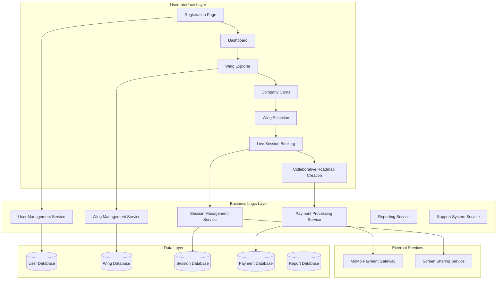
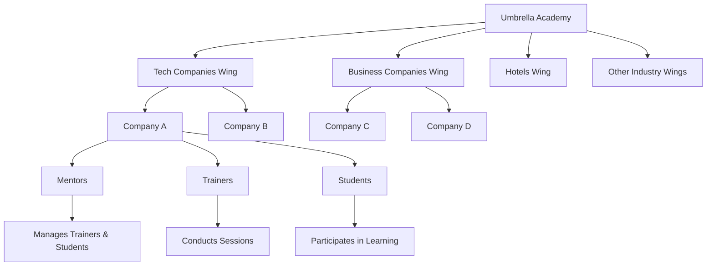
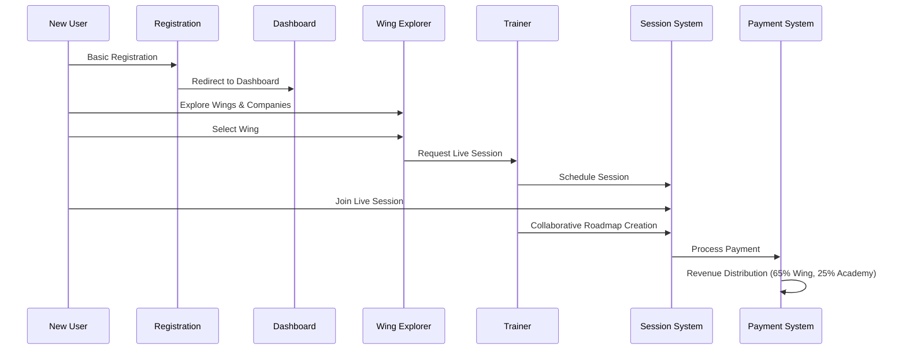

# Design Document

## Overview

This design outlines the comprehensive restructuring of an educational platform to implement a wing-based organizational hierarchy with simplified user onboarding, collaborative roadmap creation, and integrated payment systems. The design focuses on relocating existing pages rather than rebuilding functionality, while introducing new navigation patterns and organizational structures.

The system transformation centers around three key architectural changes:
1. **Simplified User Journey**: Moving from complex upfront registration to exploration-based onboarding
2. **Wing-Based Hierarchy**: Implementing a three-tier organizational structure (Wings → Companies → Users)
3. **Collaborative Workflows**: Enabling real-time trainer-student interactions for roadmap creation

## Architecture

### System Architecture Overview



### Wing-Based Organizational Hierarchy

The platform implements a three-tier hierarchical structure:



### User Flow Architecture



## Components and Interfaces

### Core Components

#### 1. User Management Component
- **Purpose**: Handle user registration, authentication, and profile management
- **Key Methods**:
  - `registerUser(basicInfo)`: Simple registration with minimal fields
  - `assignUserToWing(userId, wingId)`: Associate user with selected wing
  - `getUsersByWing(wingId)`: Retrieve wing-specific user lists
  - `updateUserProfile(userId, profileData)`: Manage user information

#### 2. Wing Management Component
- **Purpose**: Manage wing hierarchy and company information
- **Key Methods**:
  - `getWingsList()`: Retrieve all available wings
  - `getCompaniesByWing(wingId)`: Get companies within a wing
  - `getCompanyDetails(companyId)`: Fetch detailed company information
  - `createCompanyCard(companyData)`: Generate company display cards

#### 3. Session Management Component
- **Purpose**: Handle live session booking and collaborative roadmap creation
- **Key Methods**:
  - `bookLiveSession(studentId, trainerId)`: Schedule trainer-student sessions
  - `initializeScreenSharing(sessionId)`: Enable collaborative interface
  - `createCollaborativeRoadmap(sessionId, roadmapData)`: Save jointly created roadmaps
  - `getAvailableTrainers(wingId)`: Find trainers within wing

#### 4. Payment Processing Component
- **Purpose**: Handle MoMo payments and revenue distribution
- **Key Methods**:
  - `processMoMoPayment(paymentData)`: Handle mobile money transactions
  - `distributeRevenue(paymentAmount, wingId)`: Split payments (65% wing, 25% academy)
  - `generatePaymentReceipt(transactionId)`: Create payment confirmations
  - `getWingRevenue(wingId, dateRange)`: Financial reporting

#### 5. Reporting Component
- **Purpose**: Manage trainer reports and mentor approval workflows
- **Key Methods**:
  - `createStudentReport(trainerId, studentId, reportData)`: Generate progress reports
  - `submitReportToMentor(reportId, mentorId)`: Route reports for approval
  - `approveReport(mentorId, reportId)`: Mentor approval workflow
  - `getReportHistory(userId)`: Retrieve report audit trail

#### 6. Support System Component
- **Purpose**: Handle role-specific support and issue tracking
- **Key Methods**:
  - `createSupportTicket(userId, issueData)`: Submit support requests
  - `routeTicketToWingAdmin(ticketId, wingId)`: Direct issues to appropriate admin
  - `updateTicketStatus(ticketId, status)`: Track resolution progress
  - `getSupportPageContent(userRole)`: Provide role-specific support content

#### 7. Table Management Component
- **Purpose**: Provide standardized table interfaces with filtering and search capabilities
- **Key Methods**:
  - `renderDataTable(data, columns, filters)`: Generate tables with checkbox selection
  - `applyTableFilters(data, filterCriteria)`: Filter table data based on criteria
  - `handleTableSearch(data, searchQuery)`: Search across table columns
  - `manageTableSelection(selectedItems)`: Handle checkbox-based item selection

### Interface Specifications

#### Wing Explorer Interface
```typescript
interface WingExplorerProps {
  wings: Wing[]
  onWingSelect: (wingId: string) => void
  onCompanyView: (companyId: string) => void
}

interface Wing {
  id: string
  name: string
  description: string
  companies: Company[]
  totalStudents: number
  totalTrainers: number
}

interface Company {
  id: string
  name: string
  website: string
  achievements: string[]
  teachingFocus: string[]
  images: string[]
  description: string
}
```

#### Live Session Interface
```typescript
interface LiveSessionProps {
  sessionId: string
  trainerId: string
  studentId: string
  screenSharingEnabled: boolean
  roadmapForm: RoadmapFormData
}

interface RoadmapFormData {
  studentGoals: string[]
  learningPath: LearningModule[]
  timeline: TimelineItem[]
  assessmentCriteria: string[]
}
```

#### Payment Interface
```typescript
interface PaymentProcessorProps {
  amount: number
  wingId: string
  studentId: string
  paymentMethod: 'momo'
  momoDetails: MoMoPaymentData
}

interface RevenueDistribution {
  wingShare: number // 65%
  academyShare: number // 25%
  processingFee: number // 10%
  wingId: string
  transactionId: string
}
```

#### Table Management Interface
```typescript
interface DataTableProps {
  data: any[]
  columns: TableColumn[]
  hasCheckboxes: boolean
  hasFilters: boolean
  hasSearch: boolean
  onSelectionChange: (selectedItems: any[]) => void
  onFilterChange: (filters: FilterCriteria) => void
  onSearchChange: (searchQuery: string) => void
}

interface TableColumn {
  key: string
  label: string
  sortable: boolean
  filterable: boolean
  searchable: boolean
  width?: string
}

interface FilterCriteria {
  [key: string]: {
    type: 'text' | 'select' | 'date' | 'number'
    value: any
    operator: 'equals' | 'contains' | 'greater' | 'less' | 'between'
  }
}
```

## Data Models

### User Data Model
```typescript
interface User {
  id: string
  email: string
  name: string
  role: 'student' | 'trainer' | 'mentor' | 'wing_admin'
  wingId: string
  profileData: {
    avatar?: string
    bio?: string
    skills?: string[]
    experience?: string
  }
  createdAt: Date
  lastLogin: Date
  isActive: boolean
}
```

### Wing Data Model
```typescript
interface Wing {
  id: string
  name: string
  description: string
  industry: string
  companies: Company[]
  mentors: User[]
  trainers: User[]
  students: User[]
  revenueShare: number // 65%
  totalRevenue: number
  createdAt: Date
  isActive: boolean
}
```

### Session Data Model
```typescript
interface LiveSession {
  id: string
  trainerId: string
  studentId: string
  wingId: string
  scheduledAt: Date
  status: 'scheduled' | 'in_progress' | 'completed' | 'cancelled'
  screenSharingUrl?: string
  roadmapData?: RoadmapFormData
  duration: number
  notes?: string
  createdAt: Date
}
```

### Payment Data Model
```typescript
interface Payment {
  id: string
  studentId: string
  wingId: string
  amount: number
  currency: string
  paymentMethod: 'momo'
  momoTransactionId: string
  status: 'pending' | 'completed' | 'failed' | 'refunded'
  revenueDistribution: RevenueDistribution
  createdAt: Date
  processedAt?: Date
}
```

### Report Data Model
```typescript
interface StudentReport {
  id: string
  trainerId: string
  studentId: string
  mentorId: string
  wingId: string
  reportType: 'progress' | 'roadmap_update' | 'session_summary'
  content: {
    achievements: string[]
    challenges: string[]
    nextSteps: string[]
    roadmapProgress: number
  }
  status: 'draft' | 'submitted' | 'approved' | 'rejected'
  submittedAt?: Date
  reviewedAt?: Date
  mentorFeedback?: string
}
```

### Support Ticket Data Model
```typescript
interface SupportTicket {
  id: string
  userId: string
  wingId: string
  wingAdminId?: string
  title: string
  description: string
  category: 'technical' | 'billing' | 'content' | 'other'
  priority: 'low' | 'medium' | 'high' | 'urgent'
  status: 'open' | 'in_progress' | 'resolved' | 'closed'
  attachments?: string[]
  createdAt: Date
  updatedAt: Date
  resolvedAt?: Date
}
```

## Correctness Properties

*A property is a characteristic or behavior that should hold true across all valid executions of a system—essentially, a formal statement about what the system should do. Properties serve as the bridge between human-readable specifications and machine-verifiable correctness guarantees.*

### Property Reflection

After analyzing all acceptance criteria, several properties can be consolidated to eliminate redundancy:

- Properties related to wing-based access control (5.3, 5.5, 6.3, 6.4) can be combined into a comprehensive wing-scoped access property
- Properties about data preservation during migration (11.1, 11.3, 11.4, 11.5) can be consolidated into a single migration integrity property
- Properties about information display (2.3, 6.5, 8.5) can be combined into content completeness properties
- Properties about automatic routing (8.2, 9.2) can be unified into a wing-based routing property

### Core Properties

**Property 1: Registration Simplicity**
*For any* new user registration attempt, the registration form should contain only basic fields (name, email, password) and successfully create an account with immediate dashboard access upon completion
**Validates: Requirements 1.2, 1.3**

**Property 2: Wing-Company Hierarchy Integrity**
*For any* wing in the system, it should contain multiple companies displayed as cards with complete information (website links, achievements, teaching focus, images), and maintain proper hierarchical organization
**Validates: Requirements 2.2, 2.3, 2.4, 2.5**

**Property 3: User Journey Sequence Enforcement**
*For any* user attempting to access system features, the platform should enforce the sequence: registration → dashboard → wing exploration → wing selection → roadmap creation, preventing access to later steps without completing earlier ones
**Validates: Requirements 3.3, 3.4**

**Property 4: Collaborative Roadmap Creation**
*For any* roadmap creation request, the system should require trainer participation, enable screen sharing during live sessions, provide simultaneous form access to both parties, and save the completed roadmap for both participants
**Validates: Requirements 4.1, 4.2, 4.3, 4.4, 4.5**

**Property 5: Wing-Based User Organization**
*For any* user in the system, they should belong to exactly one wing, and this wing assignment should be permanent once selected and consistently displayed with user information
**Validates: Requirements 5.1, 5.2, 5.4**

**Property 6: Wing-Scoped Access Control**
*For any* user attempting to access features or perform management actions, the system should restrict access to only resources within their assigned wing scope, preventing cross-wing operations
**Validates: Requirements 5.3, 5.5, 6.3, 6.4**

**Property 7: MoMo Payment Processing with Revenue Distribution**
*For any* payment transaction, the system should process only through MoMo integration, automatically distribute 65% to the wing and 25% to Umbrella Academy, and associate the payment with the student's wing affiliation
**Validates: Requirements 7.1, 7.2, 7.3, 7.5**

**Property 8: Wing-Based Report Routing**
*For any* report created by trainers or support ticket submitted by users, the system should automatically route them to the appropriate wing mentor or wing admin based on wing affiliation
**Validates: Requirements 8.2, 9.2**

**Property 9: Audit Trail Completeness**
*For any* report submission, mentor action, or support ticket activity, the system should maintain a complete audit trail with status tracking and resolution history
**Validates: Requirements 8.4, 9.4**

**Property 10: Role-Based Content Delivery**
*For any* user accessing support pages or viewing user profiles, the system should provide role-appropriate content and comprehensive information relevant to their access level
**Validates: Requirements 9.1, 6.5**

**Property 11: Page Functionality Preservation**
*For any* existing page being relocated in the restructuring, all original functionality and content should be preserved without modification, with consistent sidebar navigation added to post-signup pages
**Validates: Requirements 10.2, 10.3, 10.4**

**Property 12: Migration Data Integrity**
*For any* existing user, payment, roadmap, or progress data during system migration, all information should be preserved and remain accessible through the new wing-based structure after migration completion
**Validates: Requirements 11.1, 11.2, 11.3, 11.4, 11.5**

## Error Handling

### Registration and Authentication Errors
- **Invalid Registration Data**: Display field-specific validation messages for incomplete or invalid registration information
- **Duplicate Email Registration**: Prevent duplicate accounts and provide clear messaging about existing accounts
- **Authentication Failures**: Implement secure login with appropriate error messages for invalid credentials

### Wing and Company Management Errors
- **Wing Selection Conflicts**: Handle cases where users attempt to change wing assignments after initial selection
- **Company Data Loading Failures**: Provide fallback content when company information cannot be loaded
- **Hierarchy Integrity Violations**: Prevent orphaned companies or users without wing assignments

### Live Session and Collaboration Errors
- **Trainer Unavailability**: Handle cases where no trainers are available for roadmap creation sessions
- **Screen Sharing Failures**: Provide alternative collaboration methods when screen sharing fails
- **Session Interruption**: Implement session recovery and data preservation for interrupted live sessions
- **Concurrent Access Conflicts**: Resolve conflicts when multiple users attempt to edit roadmap forms simultaneously

### Payment Processing Errors
- **MoMo Integration Failures**: Handle payment gateway timeouts, network issues, and transaction failures
- **Revenue Distribution Errors**: Implement rollback mechanisms for failed revenue distribution calculations
- **Payment Verification Issues**: Provide manual verification processes for disputed transactions

### Reporting and Support System Errors
- **Report Routing Failures**: Implement fallback routing when wing mentors are unavailable
- **Support Ticket Overflow**: Handle high volumes of support requests with queue management
- **Audit Trail Corruption**: Implement data integrity checks and recovery mechanisms for audit logs

### Migration and Data Integrity Errors
- **Data Migration Failures**: Implement rollback mechanisms and data validation during migration
- **Wing Assignment Conflicts**: Resolve cases where existing users cannot be clearly assigned to wings
- **Historical Data Access Issues**: Provide data recovery mechanisms for inaccessible historical information

## Testing Strategy

### Dual Testing Approach

The testing strategy employs both unit testing and property-based testing to ensure comprehensive coverage:

**Unit Tests**: Focus on specific examples, edge cases, and error conditions including:
- Registration form validation with various input combinations
- Wing selection workflow with different user states
- Payment processing with specific MoMo transaction scenarios
- Report creation and approval workflows
- Support ticket routing and resolution processes

**Property-Based Tests**: Verify universal properties across all inputs including:
- Wing-based access control across all user roles and resources
- Revenue distribution calculations for any payment amount
- Data preservation during migration for any user data set
- Collaborative roadmap creation for any trainer-student pair
- Audit trail completeness for any system activity

### Property-Based Testing Configuration

**Testing Framework**: Use Hypothesis (Python) or fast-check (TypeScript) for property-based testing
**Test Configuration**: Each property test runs minimum 100 iterations to ensure comprehensive input coverage
**Test Tagging**: Each property test includes a comment referencing its design document property:
- Format: **Feature: educational-platform-restructuring, Property {number}: {property_text}**

### Testing Coverage Areas

**User Flow Testing**:
- Registration to dashboard navigation
- Wing exploration and selection processes
- Live session booking and execution
- Payment processing and confirmation

**Access Control Testing**:
- Wing-based feature restrictions
- Role-based content delivery
- Cross-wing access prevention
- Mentor management scope limitations

**Data Integrity Testing**:
- Revenue distribution accuracy
- Report routing correctness
- Audit trail completeness
- Migration data preservation

**Integration Testing**:
- MoMo payment gateway integration
- Screen sharing service integration
- Real-time collaborative form updates
- Cross-component data consistency

**Performance Testing**:
- Large-scale wing and company data loading
- Concurrent live session handling
- High-volume payment processing
- Bulk user migration operations

The testing strategy ensures that both specific use cases and universal system behaviors are thoroughly validated, providing confidence in the system's correctness and reliability across all operational scenarios.