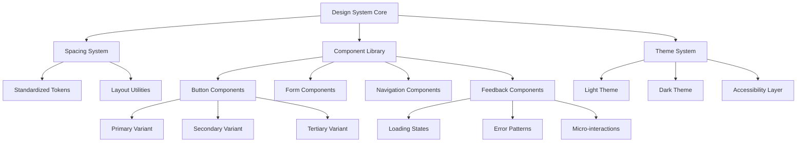

# Design Document: UI System Improvements

## Overview

This design outlines a comprehensive UI/UX improvement system for the Umbrella Academy application. The solution creates a cohesive design system built on standardized components, spacing, and interaction patterns while maintaining the existing Next.js 16.1.2 and Tailwind CSS v4 architecture.

The design prioritizes systematic improvements across three phases: foundational system standardization (Week 1-2), enhanced user experience patterns (Week 3-4), and advanced features (Month 2). All improvements maintain backward compatibility with existing components while providing clear migration paths.

## Architecture

### Design System Architecture



### Component Hierarchy

The design system follows a hierarchical structure:

1. **Foundation Layer**: Spacing tokens, color variables, typography scales
2. **Component Layer**: Reusable UI components with variants and states
3. **Pattern Layer**: Complex interaction patterns and layouts
4. **Application Layer**: Page-specific implementations using system components

### Technology Integration

- **Tailwind CSS v4**: Leverages CSS variables and custom properties for theming
- **React 19.2.3**: Uses modern React patterns including concurrent features
- **Next.js 16.1.2**: Integrates with App Router for optimal performance
- **TypeScript**: Provides type safety for all component props and variants

## Components and Interfaces

### Spacing System Interface

```typescript
interface SpacingSystem {
  // Base spacing scale (rem units)
  spacing: {
    xs: '0.25rem',    // 4px
    sm: '0.5rem',     // 8px
    md: '1rem',       // 16px
    lg: '1.5rem',     // 24px
    xl: '2rem',       // 32px
    '2xl': '3rem',    // 48px
    '3xl': '4rem',    // 64px
  };
  
  // Semantic spacing for specific use cases
  semantic: {
    formElementGap: 'md',
    sectionGap: 'xl',
    containerPadding: '2xl',
    buttonPadding: 'md',
  };
}
```

### Button Component Interface

```typescript
interface ButtonProps {
  variant: 'primary' | 'secondary' | 'tertiary' | 'ghost' | 'danger';
  size: 'sm' | 'md' | 'lg';
  loading?: boolean;
  disabled?: boolean;
  icon?: {
    position: 'left' | 'right' | 'only';
    component: React.ComponentType;
  };
  fullWidth?: boolean;
  children?: React.ReactNode;
  onClick?: (event: React.MouseEvent) => void;
  type?: 'button' | 'submit' | 'reset';
  'aria-label'?: string;
}

interface ButtonVariants {
  primary: {
    base: 'bg-yellow-600 text-white hover:bg-yellow-700';
    focus: 'focus:ring-2 focus:ring-yellow-600 focus:ring-offset-2';
    disabled: 'disabled:bg-gray-300 disabled:text-gray-500';
  };
  secondary: {
    base: 'bg-white text-yellow-600 border border-yellow-600 hover:bg-yellow-50';
    focus: 'focus:ring-2 focus:ring-yellow-600 focus:ring-offset-2';
    disabled: 'disabled:bg-gray-100 disabled:text-gray-400 disabled:border-gray-300';
  };
  // Additional variants...
}
```

### Navigation System Interface

```typescript
interface NavigationProps {
  userRole: 'student' | 'mentor' | 'trainer' | 'admin';
  currentPath: string;
  isMobile: boolean;
  isMenuOpen?: boolean;
  onMenuToggle?: () => void;
}

interface NavigationItem {
  label: string;
  href: string;
  icon: React.ComponentType;
  roles: UserRole[];
  badge?: {
    text: string;
    variant: 'info' | 'warning' | 'success';
  };
}

interface MobileNavigationBehavior {
  touchTargetSize: '44px'; // Minimum touch target
  menuTransition: 'slide-in' | 'fade-in';
  backgroundScrollLock: boolean;
  swipeGestures: boolean;
}
```

### Loading State Interface

```typescript
interface LoadingStateProps {
  type: 'spinner' | 'skeleton' | 'progress' | 'pulse';
  size?: 'sm' | 'md' | 'lg';
  message?: string;
  progress?: number; // 0-100 for progress type
  timeout?: number; // Show timeout message after ms
}

interface SkeletonProps {
  lines?: number;
  avatar?: boolean;
  width?: string | number;
  height?: string | number;
  className?: string;
}
```

### Error Handling Interface

```typescript
interface ErrorPatternProps {
  type: 'field' | 'form' | 'page' | 'toast';
  message: string;
  details?: string;
  actions?: ErrorAction[];
  dismissible?: boolean;
  autoHide?: number; // Auto-hide after ms
}

interface ErrorAction {
  label: string;
  action: () => void;
  variant: 'primary' | 'secondary';
}

interface FormErrorState {
  [fieldName: string]: {
    message: string;
    type: 'required' | 'validation' | 'server';
  };
}
```

## Data Models

### Theme Configuration Model

```typescript
interface ThemeConfig {
  mode: 'light' | 'dark' | 'system';
  colors: {
    primary: ColorScale;
    secondary: ColorScale;
    neutral: ColorScale;
    semantic: SemanticColors;
  };
  spacing: SpacingSystem;
  typography: TypographySystem;
  animations: AnimationConfig;
}

interface ColorScale {
  50: string;
  100: string;
  200: string;
  300: string;
  400: string;
  500: string;
  600: string;
  700: string;
  800: string;
  900: string;
  950: string;
}

interface SemanticColors {
  success: ColorScale;
  warning: ColorScale;
  error: ColorScale;
  info: ColorScale;
}
```

### Component State Model

```typescript
interface ComponentState {
  loading: boolean;
  error: string | null;
  disabled: boolean;
  focused: boolean;
  hovered: boolean;
  pressed: boolean;
}

interface InteractionState {
  touchDevice: boolean;
  reducedMotion: boolean;
  highContrast: boolean;
  screenReaderActive: boolean;
}
```

### Accessibility Model

```typescript
interface AccessibilityConfig {
  announcements: {
    loading: string;
    error: string;
    success: string;
  };
  keyboardNavigation: {
    trapFocus: boolean;
    skipLinks: boolean;
    customShortcuts: KeyboardShortcut[];
  };
  screenReader: {
    liveRegions: boolean;
    descriptiveLabels: boolean;
    contextualHelp: boolean;
  };
}

interface KeyboardShortcut {
  key: string;
  modifiers: ('ctrl' | 'alt' | 'shift' | 'meta')[];
  action: () => void;
  description: string;
}
```

### Performance Optimization Model

```typescript
interface PerformanceConfig {
  lazyLoading: {
    images: boolean;
    components: boolean;
    routes: boolean;
  };
  caching: {
    staticAssets: number; // Cache duration in seconds
    apiResponses: number;
    componentState: boolean;
  };
  bundleOptimization: {
    codesplitting: boolean;
    treeShaking: boolean;
    compression: 'gzip' | 'brotli';
  };
}
```

### Onboarding Flow Model

```typescript
interface OnboardingFlow {
  steps: OnboardingStep[];
  userRole: UserRole;
  progress: number; // 0-100
  completed: boolean;
  skippable: boolean;
}

interface OnboardingStep {
  id: string;
  title: string;
  description: string;
  target?: string; // CSS selector for highlighting
  action?: 'click' | 'input' | 'navigate';
  validation?: () => boolean;
  optional: boolean;
}
```

## Correctness Properties

*A property is a characteristic or behavior that should hold true across all valid executions of a system—essentially, a formal statement about what the system should do. Properties serve as the bridge between human-readable specifications and machine-verifiable correctness guarantees.*

### Property 1: Standardized Spacing Consistency
*For any* UI component in the design system, all spacing values used should come from the approved spacing token set, ensuring no custom or hardcoded spacing values exist.
**Validates: Requirements 1.1, 1.2, 1.3**

### Property 2: Spacing Pattern Consistency
*For any* group of similar UI elements (form elements, sections, containers), the spacing between them should follow consistent patterns defined in the semantic spacing configuration.
**Validates: Requirements 1.5**

### Property 3: Button Variant Completeness
*For any* button component instance, all required variants (primary, secondary, tertiary, ghost, danger) and sizes (sm, md, lg) should be available and render correctly.
**Validates: Requirements 2.1, 2.2**

### Property 4: Button State Consistency
*For any* button component, loading and disabled states should provide appropriate visual feedback and maintain accessibility requirements.
**Validates: Requirements 2.3, 2.4, 2.5**

### Property 5: Icon Integration Correctness
*For any* button with icon configuration, the icon should be positioned correctly according to the specified placement (left, right, icon-only) without breaking layout.
**Validates: Requirements 2.6**

### Property 6: Touch Target Compliance
*For any* interactive element in the system, the touch target size should meet or exceed 44px minimum requirement, with adequate spacing between adjacent interactive elements.
**Validates: Requirements 3.2, 8.1, 8.2, 8.5**

### Property 7: Navigation Consistency Across Contexts
*For any* page or route in the application, the navigation component should render consistently with appropriate role-based filtering and state preservation.
**Validates: Requirements 3.1, 3.3, 3.4**

### Property 8: Mobile Menu Behavior
*For any* mobile navigation interaction, opening the menu should prevent background scrolling and provide proper touch target sizing for all menu items.
**Validates: Requirements 3.5, 8.3, 8.4**

### Property 9: Accessibility Compliance
*For any* interactive element, proper ARIA labels, roles, focus indicators, and screen reader announcements should be present and meet WCAG 2.1 AA standards.
**Validates: Requirements 4.1, 4.2, 4.3, 4.4, 4.5, 4.6**

### Property 10: Loading State Consistency
*For any* asynchronous operation, appropriate loading indicators should be displayed with contextual feedback, timeout handling, and smooth transitions to loaded content.
**Validates: Requirements 5.1, 5.2, 5.3, 5.4, 5.5**

### Property 11: Error Pattern Consistency
*For any* error condition, the error display should follow consistent styling, provide actionable messages, highlight specific problem areas, and include recovery mechanisms where appropriate.
**Validates: Requirements 6.1, 6.2, 6.3, 6.4, 6.5**

### Property 12: Micro-interaction Responsiveness
*For any* user interaction (hover, click, form submission, navigation), appropriate visual feedback should be provided with smooth transitions that respect reduced motion preferences.
**Validates: Requirements 7.1, 7.2, 7.3, 7.4, 7.5**

### Property 13: Dark Mode Completeness
*For any* UI element, a complete dark mode variant should exist that maintains accessibility contrast requirements and persists user preferences across sessions.
**Validates: Requirements 9.1, 9.2, 9.3, 9.4, 9.5**

### Property 14: Data Visualization Accessibility
*For any* data visualization component, interactive and accessible features should be provided including tooltips, keyboard navigation, responsive design, and proper loading states.
**Validates: Requirements 10.1, 10.2, 10.3, 10.4, 10.5**

### Property 15: Onboarding Flow Completeness
*For any* user role, the onboarding flow should provide role-specific guidance, progress tracking, dismissible/resumable state, and post-completion help access.
**Validates: Requirements 11.1, 11.2, 11.3, 11.4, 11.5**

### Property 16: Performance Optimization Standards
*For any* component rendering, animation, or navigation action, performance optimizations should be applied including minimal layout shifts, efficient asset loading, hardware-accelerated animations, and resource preloading.
**Validates: Requirements 12.1, 12.2, 12.3, 12.4, 12.5**

## Error Handling

### Component Error Boundaries

The design system implements comprehensive error boundaries at multiple levels:

1. **Component Level**: Each major component wraps its content in error boundaries that gracefully degrade functionality
2. **Page Level**: Route-level error boundaries catch navigation and rendering errors
3. **System Level**: Global error boundary handles unexpected system failures

### Error Recovery Strategies

```typescript
interface ErrorRecoveryStrategy {
  // Automatic retry for transient errors
  autoRetry: {
    maxAttempts: number;
    backoffStrategy: 'linear' | 'exponential';
    retryableErrors: string[];
  };
  
  // Graceful degradation for component failures
  fallbackComponents: {
    [componentName: string]: React.ComponentType;
  };
  
  // User-initiated recovery actions
  userActions: {
    refresh: boolean;
    retry: boolean;
    reportIssue: boolean;
  };
}
```

### Error State Management

- **Field-level errors**: Displayed inline with form fields using consistent styling
- **Form-level errors**: Shown at form top with summary of all validation issues
- **Page-level errors**: Full-page error states with recovery options
- **Toast notifications**: Temporary error messages for non-critical issues

### Accessibility in Error Handling

- All errors announced to screen readers via live regions
- Error messages associated with form fields using `aria-describedby`
- Focus management to error locations for keyboard users
- High contrast error indicators for visual accessibility

## Testing Strategy

### Dual Testing Approach

The UI system improvements require both unit testing and property-based testing for comprehensive coverage:

**Unit Tests**: Focus on specific examples, edge cases, and integration points
- Component rendering with specific props
- User interaction scenarios
- Error boundary behavior
- Theme switching functionality
- Accessibility compliance for specific elements

**Property Tests**: Verify universal properties across all inputs
- Component consistency across all variants and states
- Accessibility compliance across all interactive elements
- Performance characteristics across different data sets
- Theme compatibility across all components

### Property-Based Testing Configuration

- **Testing Library**: React Testing Library with @fast-check/jest for property-based testing
- **Minimum Iterations**: 100 iterations per property test
- **Test Tagging**: Each property test tagged with format: **Feature: ui-system-improvements, Property {number}: {property_text}**

### Testing Categories

1. **Visual Regression Testing**: Automated screenshot comparison for component consistency
2. **Accessibility Testing**: Automated a11y audits using @axe-core/react
3. **Performance Testing**: Bundle size analysis and runtime performance metrics
4. **Cross-browser Testing**: Compatibility testing across modern browsers
5. **Responsive Testing**: Layout validation across device sizes

### Integration Testing Strategy

- **Component Integration**: Test component interactions within complex layouts
- **Theme Integration**: Verify theme switching affects all components correctly
- **Navigation Integration**: Test navigation state persistence across route changes
- **Form Integration**: Validate form components work together seamlessly

### Test Data Generation

Property-based tests use generated data for comprehensive coverage:
- Random component props within valid ranges
- Generated user interaction sequences
- Simulated network conditions and delays
- Various screen sizes and device capabilities
- Different user roles and permission levels

The testing strategy ensures that the UI system improvements maintain quality and consistency while providing confidence in the system's behavior across all possible usage scenarios.